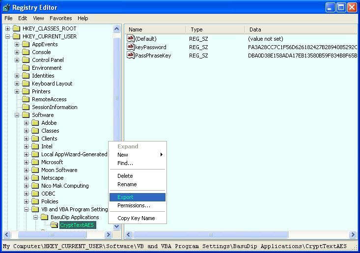



## Encrypt messages with secure AES method

### Description

A textCrypt application to encrypt/decrypt text messages. This application can also create a shared key, and can encrypt/decrypt messages encrypted with the key. The key is protected with a private password. The application use the Rijndael AES algorithm. This is the Final BETA release of the software.

AES is the Advanced Encryption Standard, which is the result of a three-year competition sponsored by the U.S. Government's National Institute of Standards (NIST). This encryption method, also known as Rijndael, has been adopted by NIST as a Federal Information Processing Standard.

Please send me your feedback and comments, your effort in this direction is highly appreciated.
 
### More Info
 

             |
---                |---
**Submitted On**   |2006-02-17 21:33:14
**By**             |[Dipankar\_Basu](https://github.com/Planet-Source-Code/PSCIndex/blob/master/ByAuthor/dipankar-basu.md)
**Level**          |Intermediate
**User Rating**    |4.3 (13 globes from 3 users)
**Compatibility**  |VB 5\.0, VB 6\.0
**Category**       |[Encryption](https://github.com/Planet-Source-Code/PSCIndex/blob/master/ByCategory/encryption__1-48.md)
**World**          |[Visual Basic](https://github.com/Planet-Source-Code/PSCIndex/blob/master/ByWorld/visual-basic.md)
**Archive File**   |[Encrypt\_me1975892242006\.ZIP](https://github.com/Planet-Source-Code/dipankar-basu-encrypt-messages-with-secure-aes-method__1-64437/archive/master.zip)

